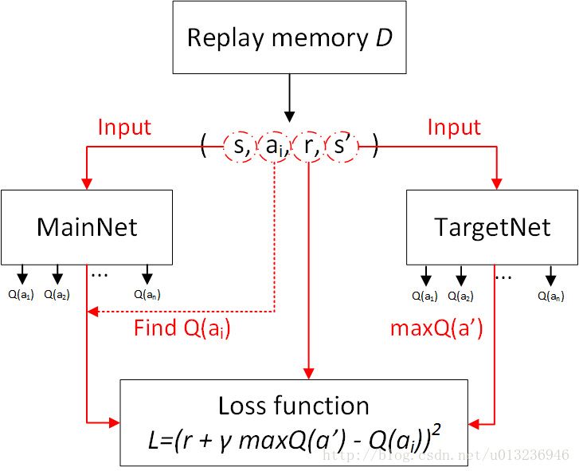
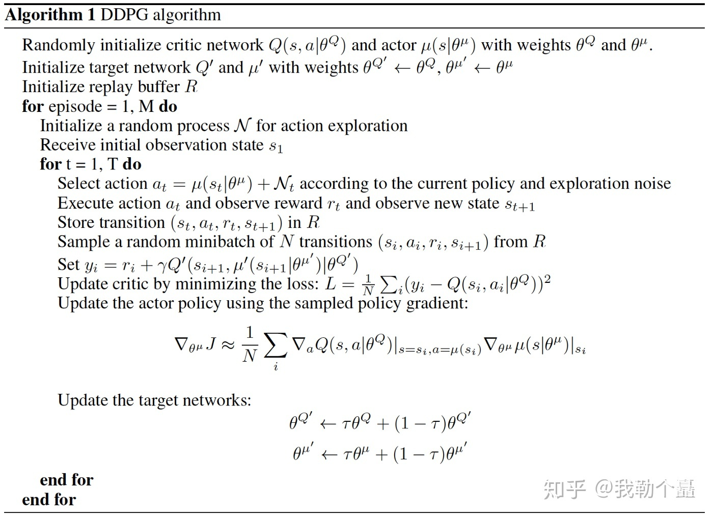

# AI

## 开源工具
- **[OpenAI Gym](https://gym.openai.com)**: OpenAI 公司发布一种用于开发和比较强化学习算法的工具包，提供了多种环境，比如Atari、棋盘游戏以及 2D 或 3D 游戏引擎等。
- **[PyTorch3D](https://github.com/facebookresearch/pytorch3d)**：FaceBook开源的基于 PyTorch 的新 3D 计算机视觉库
- **[DALI](https://github.com/NVIDIA/DALI)**: 和 TensorFlow 自带的 DataLoader 类似，是一个专门用于加速数据预处理过程的库，PyTorch+DALI 的处理速度比原版 PyTorch 要快近 4 倍
- **[Wav2lette++](https://github.com/facebookresearch/wav2letter)**: Facebook宣布开源的全卷积语音识别工具包
- **[Ludwig](https://github.com/uber/ludwig)**: Uber开源的一个基于TensorFlow的工具箱，无需编写代码即可训练和测试深度学习模型
- **[Pyro](https://github.com/pyro-ppl/pyro)**:  Uber AI 实验室开源的一款深度概率编程语言，基于PyTorch
- **[Detectron2](https://github.com/facebookresearch/detectron2)**: Facebook开源的基于 PyTorch 的新一代目标检测工具
- **[textclf](https://github.com/luopeixiang/textclf)**: 基于Pytorch/Sklearn的文本分类框架，包括逻辑回归、SVM、TextCNN、TextRNN、TextRCNN、DRNN、DPCNN、Bert等多种模型，通过简单配置即可完成数据处理、模型训练、测试等过程
- **[face_recognition](https://github.com/ageitgey/face_recognition)**: 基于dlib的深度学习人脸识别库，在LFW上的准确率达到了99.38%
- **[mne-python](https://github.com/mne-tools/mne-python)**: 用于EEG/MEG信号的预处理和去噪，源估计，时频分析，统计测试，功能性连接，机器学习，传感器和源的可视化等

## 神经网络
- **人工神经网络ANN/多层感知器MLP/前馈神经网络**:
  1. 由输入层、隐藏层和输出层三层组成
  2. 能够学习任意非线性函数，因为激活函数将非线性特征引入网络中
  3. MLP解决图像分类问题时缺点：随着图像增大，可训练参数的数量会急剧增加;会丢失图像的空间特征
  4. 无法捕获处理序列数据所需的输入数据中的顺序信息
  5. 存在梯度消失和爆炸问题
- **循环神经网络RNN**
  1. 隐藏状态上有一个循环连接，此循环约束能够确保在输入数据中捕捉到顺序信息
  2. 跨不同的时间步长共享参数
  3. 存在梯度消失和爆炸问题
- **长短期记忆网络LSTM**
  1. 是一种时间递归神经网络，适合于处理和预测时间序列中间隔和延迟相对较长的重要事件
  2. 通过输入门、遗忘门和输出门三个这样的门来实现信息的保护和控制
- **GRU**
  1. 相比LSTM更容易进行训练，能够很大程度上提高训练效率
  2.  使用了一个门控z 就可以进行遗忘和选择记忆，而 LSTM 要使用多个门控
- **卷积神经网络CNN**
  1. 构建块是过滤器，也就是内核，内核的作用是利用卷积运算从输入中提取相关特征
  2. 能够自动学习过滤器，这些过滤器有助于从输入数据中提取正确的相关特征
- **图神经网络GNN**
  1. 一种直接作用于图结构上的神经网络
  2. 应用方向有风控领域、推荐系统、生物医疗、用GCN进行图像分类等
- **胶囊图神经网络CapsGNN**
  1. 以胶囊形式对节点特征进行提取，利用路由机制来捕获图形级别的重要信息
  2. 包含的注意力模块可用于处理各种尺寸的图，让模型能够专注处理图的关键部分
- **生成对抗网络GAN**
  1. 由一个生成器和一个判别器构成
  2. 生成器: 捕捉真实数据样本的潜在分布，并生成新的数据样本
  3. 判别器: 一个二分类器，判别输入是真实数据还是生成的样本
  4. 优化过程是一个极小极大博弈问题，优化目标是达到纳什均衡，使生成器估测到数据样本的分布
- **生成式教学网络GTN**：能够生成数据或生成训练环境，学习器（例如，某种刚刚经过初始化的神经网络）在接受目标任务（例如，识别图中的物体）之前，可以使用 GTN 生成的数据或训练环境进行训练
- **LeNet**
  1. 1998年， LeCun提出了第一个真正的卷积神经网络，也是整个神经网络的开山之作
  2. 现在主要指的是 LeNet5或 LeNet-5，主要特征是将卷积层和下采样层相结合作为网络的基本机构，如果不计输入层，该模型共 7层，包括 2个卷积层， 2个下采样层， 3个全连接层
- **AlexNet**
   1. 在 2012年， Alex Krizhevsky、 Ilya Sutskever提出，在 ImageNet竞赛上大放异彩，领先第二名 10%的准确率夺得了冠军
   2. 有 5 个卷积层和 3 个最大池化层，本质上就是扩展 LeNet 的深度
   3. 使用 ReLU激活函数、局部响应归一化、重叠池化层、使用 GPU训练
   4. AlexNet使用了数据扩增与丢失输出两种技巧。数据扩增： a、图像的平移、翻转， b、基于 PCA的 RGB强度调整。丢失输出技巧（ DropOut层）， AlexNet以 0.5的概率将两个全连接层神经元的输出设置为 0，有效阻止了过拟合现象的发生
- **VGG-Net**
   1. 在 2014年，参加 ILSVRC竞赛的“ VGG”队在 ImageNet上获得了比赛的亚军
   2. 核心思想是利用较小的卷积核来增加网络的深度
   3. 常用的有 VGG16、 VGG19两种类型。 VGG16拥有 13个卷积层（核大小均为 3 * 3）， 5个最大池化层， 3个全连接层。 VGG19拥有 16个卷积层（核大小均为 3 * 3）， 5个最大池化层， 3个全连接层
- **GoogLeNet**   
   1. 在 2014年的比赛中获得了冠军
   2. 专注于加深网络结构，与此同时引入了新的基本结构—— Inception模块，从而来增加网络的宽度
   3. 共包含 9个 Inception V1模块，所有层均采用了 ReLU激活函数
   4.  Inception模块不断的改进，现在已发展到 V4。 GoogLeNet V2中的 Inception参考 VGGNet用两个 3 * 3核的卷积层代替了具有 5 *5 核的卷积层，与此同时减少了一个辅助分类器，并引入了 Batch Normalization（BN）
- **ResNet**
   1. 由微软研究院提出，在 2015年的 ImageNet竞赛获得了冠军
   2. 通过残差模块能够成功的训练高达 152层深的网络
   3. ReNet与普通残差网络不同之处在于，引入了跨层连接（ shorcut connection），来构造出了残差模块
- **DenseNet**：与 ResNet 的主要区别在于，DenseNet 里模块B的输出不是像 ResNet 那样和模块A的输出相加，而是在通道维上连结。这样模块A的输出可以直接传入模块B后面的层。在这个设计里，模块A直接跟模块B后面的所有层连接在了一起。这也是它被称为“稠密连接”的原因
- **MobileNets**
  1. Google针对手机等嵌入式设备提出的一种轻量级的深层神经网络
  2. 大大减少了网络层的参数数量，使得网络的前向传播和后向传播的运算量大幅减少
- **TextCNN**：一种CNN，利用卷积神经网络对文本进行分类。结构：降维---> conv ---> 最大池化 --->完全连接层--------> softmax
- **DPCNN**：腾讯 AI-lab 提出的一种基于 word-level 级别的网络-DPCNN，由于 TextCNN 不能通过卷积获得文本的长距离依赖关系，而论文中 DPCNN 通过不断加深网络，可以抽取长距离的文本依赖关系
- **Bert**: 谷歌AI团队在2018年10月11日发布，可用于问答、推理、问答系统、命名实体识别、文档聚类、邮件过滤和分类、情感分析等；它采用双向 Transformer 用于语言模型
- **ConvLSTM**：结合了ConvNets的模式识别和纯LSTM网络的“记忆”特性
- **HetSANN**：滴滴AI Labs团队自主研发的一种基于注意力机制的异构图神经网络模型，该模型无需使用传统模型中由专家定义的元路径，能够直接自动化地处理、挖掘原异质信息网络中丰富的语义信息，为网络中的实体提取出更有效的编码表示以应用到实体分类等下游任务中

## 资源
- **Pytorch资源**: [Awesome-pytorch-list](https://github.com/bharathgs/Awesome-pytorch-list)
- **汉化Pytorch资源**: [Awesome-pytorch-list-CNVersion](https://github.com/xavier-zy/Awesome-pytorch-list-CNVersion)
- **Roboflow开源的人工检查自动驾驶数据集**：数据集包含11个类和97942个标签的15000张图像，其中还包含1720个没有标签的图像,[下载地址](https://public.roboflow.ai/object-detection/self-driving-car)
- **GNN论文整理**: [GNNPapers](https://github.com/thunlp/GNNPapers)
- **AI方面法律论文**: [LegalPapers](https://github.com/thunlp/LegalPapers)

## 学术研究
- [完全由硬件实现的忆阻器卷积神经网络CNN](https://www.nature.com/articles/s41586-020-1942-4#data-availability): 基于忆阻器的神经形态计算可以提供非冯诺伊曼计算范式，即存储数据，从而消除数据迁移的开销
- [SimCLR视觉表示对比学习简单框架](https://arxiv.org/abs/2002.05709): 图灵奖得主Hinton团队提出的自监督学习方法, 通过对比损失最大化了同一示例不同增强视图的隐藏层之间的一致性
   1. 多个数据增强的组合
   2. 在表示和对比之间引入可学习的非线性变换
   3. 更大的批处理规模和更多的训练步骤
   4. 温度标度交叉熵损失的归一化
- [从时间序列的抽象表示到层级化强化学习](https://www.sciencedirect.com/science/article/pii/S089662731500776X)
   1. 传统强化学习难点在于agent的行为通常改变环境，而环境影响行为策略
   2. 核心思想：如果把动作看做一组时间序列，我们可以对动作的集合本身建立一套语法规则，得到一组由若干动作组成的动作的宏，它们可以作为新的基本单位被学习
- [长距离的量子纠缠](https://nature.com/articles/s41586-020-1976-7): 通过发展高亮度光与原子纠缠源、低噪高效单光子频率转换技术和远程单光子精密干涉技术，实现了50公里的量子纠缠
- [短小时序预测-基于特征重构的张量ARIMA](https://mp.weixin.qq.com/s?__biz=MzI5NTIxNTg0OA==&mid=2247501162&idx=2&sn=8aadbb91104ead247254be6cb5087ba5&chksm=ec5472eddb23fbfbb26fe0d13b63dde25c27bbcd0b3766c152ef338e5ac1f12ca25c252ad0ba&scene=21#wechat_redirect): 借助多路延时变换技术将源时间序列数据增广为高阶张量，并将张量分解技术与经典时序预测模型ARIMA结合
- [利用无线电波，让机器视觉穿透墙壁和黑暗，不会侵犯隐私](http://arxiv.org/abs/1909.09300): 利用可见光和无线电波，同时记录同一场景的视频图像。机器视觉系统已经能够从可见光图像中识别人类的行为。因此，下一步就是要在可见光图像与同一场景下的无线电波图像之间，建立关联

## Python
- [Paramiko](https://github.com/paramiko/paramiko): 使用SSHv2协议实现远程控制库
- [numba](https://github.com/numba/numba): 是一款可以将python函数编译为机器代码的JIT编译器，经过numba编译的python代码（仅限数组运算），其运行速度可以接近C或FORTRAN语言
- [HTTPX](https://github.com/encode/httpx): 在支持 requests 标准功能的同时，还支持 HTTP/2 与 HTTP/1，以及通过 ASGI 协议直接调用 Python 网络应用
- [Starlette](https://github.com/encode/starlette): 打包了 WebSocket、GraphQL、进程内后台任务等多种功能，是真正高性能的轻量级 ASGI 框架与工具箱
- [Modin](https://github.com/modin-project/modin): 为加速pandas而开发的包，可以自动按照电脑CPU数调整运行的核数
- [bamboolib](https://github.com/tkrabel/bamboolib): Jupyter的扩展, pandas dataframes图形化操作界面
- [pdfminer3k](https://github.com/python-fan/pdf2word): 实现pdf转word
- [myqr](https://github.com/sylnsfar/qrcode): 能够生成自定义二维码的库，可以根据需要生成普通二维码、带图片的艺术二维码，也可以生成动态二维码

## 优化算法
- **GD**: 求损失函数最小值：梯度下降；求损失函数最大值：梯度上升
- **BGD**: 在更新参数时使用所有的样本来进行更新，所以计算起来非常慢
- **SGD**: 仅仅选取一个样本j来求梯度，比较快，并且可以新增样本。因为更新比较频繁，会造成 cost function 有严重的震荡
- **MBGD**：每一次利用一小批样本，即 n 个样本进行计算，这样它可以降低参数更新时的方差，收敛更稳定，另一方面可以充分地利用深度学习库中高度优化的矩阵操作来进行更有效的梯度计算。不能保证很好的收敛性
- **Momentum**：GD 在 ravines 的情况下容易被困住迟迟不能接近极小值。 Momentum 通过加入 γv_t−1 ，可以加速 SGD， 并且抑制震荡
- **Nesterov Accelerated Gradient**：用 θ−γv_t−1 来近似当做参数下一步会变成的值，则在计算梯度时，不是在当前位置，而是未来的位置上
- **Adagrad**：可以对低频的参数做较大的更新，对高频的做较小的更新，也因此，对于稀疏的数据它的表现很好，很好地提高了 SGD 的鲁棒性。缺点是分母会不断积累，这样学习率就会收缩并最终会变得非常小
- **Adadelta**：对 Adagrad 的改进，和 Adagrad 相比解决 Adagrad 学习率急剧下降问题。就是分母的 G 换成了过去的梯度平方的衰减平均值，指数衰减平均值，将学习率 η 换成了 RMS[Δθ]，这样的话甚至都不需要提前设定学习率了
- **RMSprop**：对 Adagrad 的改进，和 Adagrad 相比解决 Adagrad 学习率急剧下降问题。使用的是指数加权平均，旨在消除梯度下降中的摆动，与Momentum的效果一样，某一维度的导数比较大，则指数加权平均就大，某一维度的导数比较小，则其指数加权平均就小，这样就保证了各维度导数都在一个量级，进而减少了摆动。允许使用一个更大的学习率η
- **Adam**：相当于 RMSprop + Momentum，像 Adadelta 和 RMSprop 一样存储了过去梯度的平方 vt 的指数衰减平均值 ，也像 momentum 一样保持了过去梯度 mt 的指数衰减平均值。用脱离方法调整更新，通过去偏差的方差归一化
- **LAMB**: 通过更准确的分层，削减信任比来调整Adam的学习率

## 激活函数
[Casper Hansen激活函数图文介绍](https://mlfromscratch.com/activation-functions-explained/#/)
- **sigmoid**:
- **tanh**:
- **ReLU**:
- **ELUs**:
- **Leaky ReLUs**:
- **PReLU**:
- **RReLU**:
- **Mish**

## 损失函数
- **Focal Loss**:

## 强化学习
- **Q-learning**

  初始化$Q(s,a),\forall s \in S, a \in A(s),$ 任意的数值，并且$Q = \{\}$
  重复(for each episode):
  &ensp;&ensp;初始化 状态$S$
  &ensp;&ensp;重复(for each step of episode):
  &ensp;&ensp;&ensp;&ensp;使用策略$\pi$($\epsilon - greedy$), 获取动作$a=\pi (S)$
  &ensp;&ensp;&ensp;&ensp;执行动作a，获取新的状态$S'$与奖励$R(S,a)$
  &ensp;&ensp;&ensp;&ensp;$Q[S,A] \leftarrow (1-\alpha)*Q[S,A] + \alpha*(R(S,a) + \gamma*max \,Q[S',a])$
  &ensp;&ensp;&ensp;&ensp; $S \longleftarrow S'$
  &ensp;&ensp;直到$S$终止
  
  - **ε-greedy**：每个状态以**ε**的概率进行探索，此时将随机选取动作，而剩下的**1-ε**的概率则进行开发，即按上述方法，选取当前状态下效用值较大的动作
  
  - **α**为**学习速率**（learning rate），**γ**为**折扣因子**（discount factor）。根据公式可以看出，学习速率α越大，保留之前训练的效果就越少。![[公式]](https://www.zhihu.com/equation?tex=max_aQ%28S%27%2C+a%29)是记忆中的利益，折扣因子γ越大，所起到的作用就越大，就会越重视以往经验，越小，就会越重视眼前利益（R）

- **SARSA**
	Q-Learning在走下一步的时候是先看下一步应该走哪，但是最后不一定走，而Sarsa是决定完要走的步之后一定会去走那一步。Sarsa虽然说是说到做到，但是由于它选取下一步的位置是严格按照已有学习到的经验来选择，所以它探索未知位置的能力就会很差。

- **Sarsa lambda**
    Sarsa lambda在Sarsa的基础上增加了一个概念，就是它到终点后会再反过来看一下自己曾经走过的路。整体来说还是Sarsa的框框，只是增加一个指标，只是这样可以使学习效率变高，能更快速的达到目的Q表。

- **DQN**
	当状态和动作空间是离散且维数不高时可使用Q-Table储存每个状态动作对的Q值，而当状态和动作空间是高维连续时，使用Q-Table不现实，DQN就是要设计一个神经网络结构，通过函数来拟合Q值。
	它建立了两个网络，一个target网络，一个eval网络，同时使用了经验回放机制。

- **蒙特卡洛策略梯度REINFORCE**
	首先随机初始化参数$\theta$，对每个episode，计算其t=1到t=T-1的$return\,\nu_{t}$，然后使用随机梯度上升法更新参数。对于策略梯度定理公式里的期望，我们通过采样的形式来替代，即使用t时刻的return作为当前策略下动作价值函数的无偏估计。
	REINFORCE存在如下三个问题：
	
	1. 由于agent在一个episode中会采取很多动作，我们很难说哪个动作对最后结果是有用的，换句话说，这种算法存在高方差（variance）;
	2. 收敛速度慢
	3. 只在episodic环境下能用
	

- **Actor-Critic策略梯度**
	拿一个 Critic 去学习这些奖惩机制, 学习完了以后. 由 Actor 来指手画脚, 由 Critic 来告诉 Actor 你的那些指手画脚哪些指得好, 哪些指得差, Critic 通过学习环境和奖励之间的关系, 能看到现在所处状态的潜在奖励, 所以用它来指点 Actor 便能使 Actor 每一步都在更新, 如果使用单纯的 Policy Gradients, Actor 只能等到回合结束才能开始更新.
	
	Actor-Critic 涉及到了两个神经网络, 而且每次都是在连续状态中更新参数, 每次参数更新前后都存在相关性, 导致神经网络只能片面的看待问题, 甚至导致神经网络学不到东西.

- **GAE算法**

- **PPO算法**

- **DPPO算法**

- **DDPG算法**
  是**Actor-Critic**和**DQN**算法的结合体
  

- **A3C算法**

## 卷积
- 3D卷积
- 1×1卷积
- 转置卷积
- 扩张卷积
- 可分卷积
- 平展卷积
- 分组卷积
- 混洗分组卷积
- 逐点分组卷积

## pytorch
-  **nn.AdaptiveAvgPool2d**

## 参考
- https://www.jianshu.com/p/91fbc682fb3e
- https://zhuanlan.zhihu.com/p/25319023
- https://zhuanlan.zhihu.com/p/36494307
- https://zhuanlan.zhihu.com/p/25831658
- https://www.tuicool.com/articles/FZvMNfB