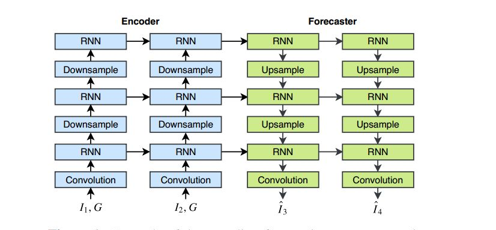

### 简介
**Trajectory GRU**是2017年香港科技大学提出的用于短临降雨预报的一个模型。

 **ConvLSTM**虽然使用的卷积递归结构在捕获时空相关性方面优于全连通递归结构**FC-LSTM**，但是
 卷积递归结构是位置不变的，而自然运动和变换(如旋转)通常是位置变化的。

### encoding-forecasting结构
1.  将观测值输入到N层RNN中，得到N个RNN state
2. 基于这些编码得到的状态，利用另外一个N层的RNN网络获取预测值
3. 在神经网络之间插入了下采样层和上采样层，这些层是通过带tride步长的convolution卷积和deconvolution反卷积来实现的。
将预测网络的顺序颠倒，是因为**高阶状态high-level state能够捕捉全局的时空表征，从而指导低阶状态low-level state的更新**，
low-level state进一步影响预测。

    

### Trajectory GRU
   **ConvGRU**或者其他**ConvRNNs**等的不足在于所有位置的连接结构和权值都是固定的
   
   大多数运动模式对于不同的位置有不同的邻域集。例如，旋转和缩放会产生指向不同方向的不同角度的流场。
因此，更合理的做法是使用基于位置变化的连接结构
    
   **TrajGRU**，它使用当前输入和以前的状态在每个时间戳为每个位置生成本地邻域集
